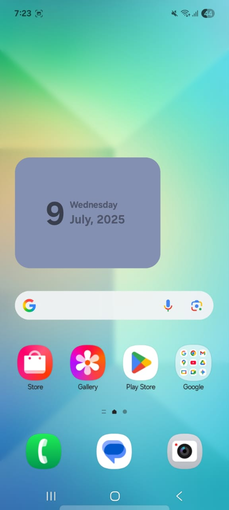
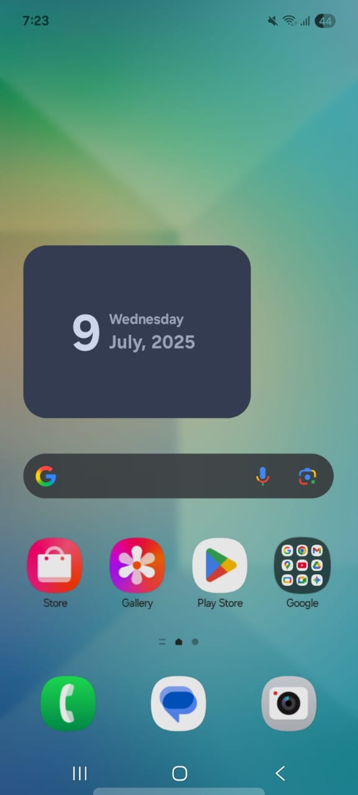

# 📅 KalendarGlance

KalendarGlance is a minimal, glanceable calendar widget built using **Jetpack Compose** and **Glance**. It beautifully displays the current date, day of the week, and month in a compact design, supporting both **light** and **dark** themes — all from your Android home screen.

---

## ✨ Features

- 📆 Displays current date, day, and month
- 🌙 Fully supports Light and Dark modes
- ⚡ Built with Jetpack **Glance** for lightweight widgets
- 💡 Kotlin-first modern design
- 📱 Easy to add to your home screen
- 🎯 Click to show a toast with full date format

---

## 🖼️ Widget Preview

<table>
  <tr>
    <td align="center">
      🌞 <strong>Light Mode</strong><br><br>
      
    </td>
    <td align="center">
      🌚 <strong>Dark Mode</strong><br><br>
      
    </td>
  </tr>
</table>

---

## 🚀 Getting Started

### Clone the project

```bash
git clone https://github.com/vivekbargude/KalendarGlance.git
cd KalendarGlance
````

### Open in Android Studio

Open the project in Android Studio Arctic Fox or later with **Kotlin 1.9+** and **Jetpack Glance** dependencies properly configured.

### Run on emulator or device

1. Build and run the app.
2. Long-press on your home screen → Add Widget.
3. Search for **KalendarGlance** and drag it to your home screen.

---

## 📦 Built With

* [Jetpack Compose](https://developer.android.com/jetpack/compose)
* [Jetpack Glance](https://developer.android.com/develop/ui/glance)
* Kotlin
* Android SDK 31+

---

## 🛠️ Folder Structure

```
📁 widgets/
 └── KalengetWidget.kt      # GlanceAppWidget logic

📁 utils/
 └── DateTimeUtils.kt       # Helper for formatting and calendar handling

📁 res/xml/
 └── app_widget_provider.xml
```

---
## 🙌 Acknowledgments

* Jetpack Glance by Android Team
* Kotlin by JetBrains
* Icons from Android Asset Studio

---

